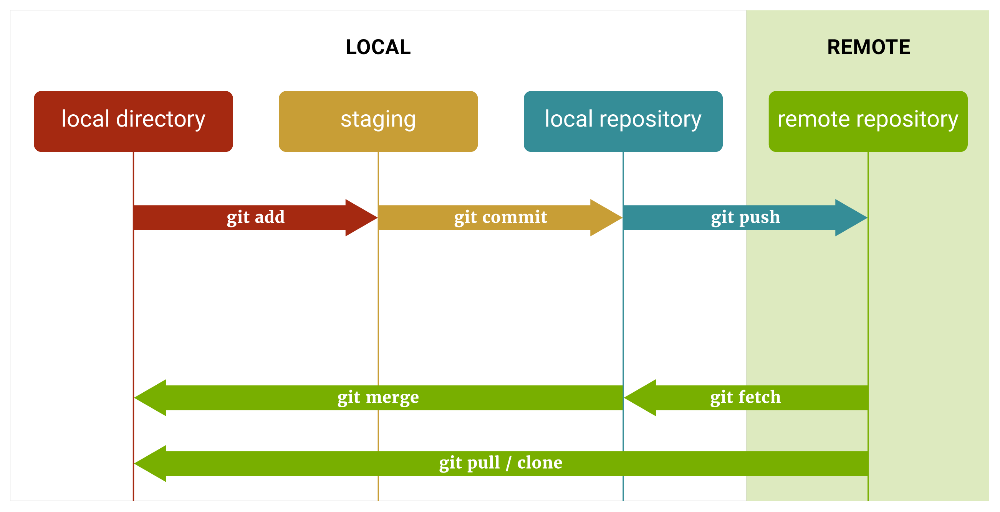

# MOST USED GIT COMMANDS @POCO

A customized list of some very useful commands with GIT.<br>
Git is (incredibily :flushed:) complex. We have a lot of tutorials online where everybody tries to summarize "the best Git commands".<br>
The content bellow is what I believe to be the most useful for us, at Powercoders.

<br>

## Git Workflow


<br>

---

<br>

## Before using Git, be sure you're in the right folder
  > *Not related to Git but, the first thing to do, **always**, is to go into the target folder :*
  ```sh
  # Generic
  $ cd <path>

  # Example
  $ cd ~/powercoders/my-project
  ```

<br>

---

<br>

## Most used Git commands at Poco


  ### clone
  > *Cloning a remote repository from Git. A clone is an exact replica of the target. More [HERE](https://www.atlassian.com/git/tutorials/setting-up-a-repository/git-clone).*
  
  ```sh
  # Generic
  $ git clone <url>
  
  # Example :
  $ git clone https://github.com/powercoders-lausanne/support.git
  ```


  <br>
  ---
  <br>


  ### status
  > *Displays the state of the working directory and the staging area. More [HERE](https://www.atlassian.com/git/tutorials/inspecting-a-repository).*

  ```sh
  $ git status

  # This will show something like this :
  On branch master
  Your branch is up to date with 'origin/master'.

  Changes not staged for commit:
  (use "git add <file>..." to update what will be committed)
  (use "git restore <file>..." to discard changes in working directory)
  modified:   "GIT/README.md"

  no changes added to commit (use "git add" and/or "git commit -a")
  ```


  <br>
  ---
  <br>


  ### add → commit → push
  > *Adding the latest changes to Git while describing what these changes are.*<br>
  > *Those 3 come together, in this order. More [HERE](https://www.atlassian.com/git/tutorials/saving-changes).*


  1. ### add

      ```sh
      # Generic
      $ git add <file name 1> <file name 2>
      
      # Examples
      $ git add README.md                         # a file at the root (same level as .git folder)
      $ git add css/styles.css                    # a file inside a folder
      $ git add index.html about.html             # add two (or more) files
      $ git add .                                 # add ALL the files (who changed)
      
      # [Remember] Git do not add empty folders.
      ```

  2. ### commit

      ```sh
      # Generic
      $ git commit -m "short description of the change you made to the file(s)"
      
      # Examples when adding/updating "styles.css"
      $ git commit -m "Initial commit"            # Only once, when the file is created
      $ git commit -m "Updated helper classes"
      $ git commit -m "Removed repetead styles"
      ```
  
  3. ### push
      ```sh
      # Generic and example
      $ git push
      ```
  
  <br>

  **[TIP] For lazy people: *add, commit, push* in one step**<br>
  > *You could do this when you're trained enough with Git and you want to accelerate things.*<br>
  > *Don't use this if you're just discovering Git ! First, work a little.* :-)

  ```sh
  # 1. Create an alias in your ".bash_profile" or ".bashsrc" file.
  # In this case, we'll create the alias "gitGO" who refers to the "git_add_commit_push()" function :
  git_add_commit_push() {
    git add .
    git commit -m "$1"
    git push
  }
  alias gitGO=git_add_commit_push

  # 2. Restart your bash console
  
  # 3. After restarting your bash console, use the alias like this :
  $ gitGO "your message..."
  ```


  <br>
  ---
  <br>


  ### pull
  > *Integrate remote changes. More [HERE](https://www.atlassian.com/git/tutorials/syncing/git-pull).*
  
  ```sh
  # Example
  $ git pull
  ```

  <br>
  ---
  <br>


  ### checkout
  > *Switching branches. More [HERE](https://www.atlassian.com/git/tutorials/using-branches/git-checkout).*
  
  ```sh
  # Generic
  $ git checkout <branch name>

  # Example, switching from current branch (usually "master") to "gh-pages"
  $ git checkout gh-pages
  ```


  <br>

  ---

  <br>


## When you have Git errors (conflicts)
> The most often these errors occur when you have what Git calls "conflicts".<br>
> :warning: Using the ```--force``` flag is **destructive**. Do this only if you're working alone and you know what you're doing !
> 
> So, if this happens to you :

  1. #### You have something *(new or newer)* on the remote not present on your local files.
   
      Git will refuse to push your local changes and will tell you to do a ```pull``` first.<br>
      So, try first to pull the new stuff from the remote :
  
      ```sh
      # 1. Pull the changes from the remote
      $ git pull

      # 2. Push your local changes
      $ git push
      ```

  2. #### Force local files to replace remote files.
   
      :warning: You'll lose every change you may have on the remote repository.
  
      ```sh
      # Replace "master" if the branch name is different
      $ git push origin master --force 
      ```

  3. #### Force a replacement of your local files.
   
      :warning: You'll lose every change you may have on local repository.<br>
  
      ```sh
      # Replace "master" if the branch name is different
      $ git fetch --all
      $ git reset --hard origin/master
      ```

  4. #### Force a replacement of your local files AND DELETE all the files/folders not present on remote.
   
      :warning: Git ```clean``` deletes all your untracked files/directories and can't be undone.<br>
  
      ```sh
      # WARNING: this can't be undone !
      $ git reset --hard HEAD
      $ git clean -f -d
      $ git pull
      ```
