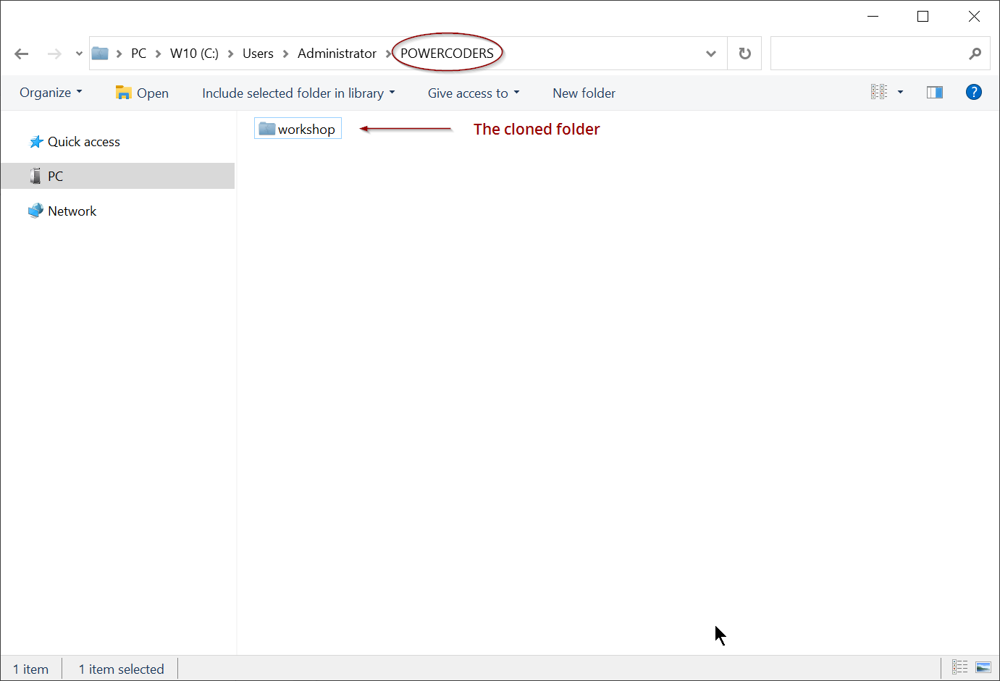

# GITHUB - ACCOUNT AND BASIC FOLDER STRUCTURE  
Please follow the steps bellow to create a Github account and set up your work repository for PowerCoders

<br>

## A. Create a [Github account](https://github.com/join)

We will create together a Github account for each one of you, in class, the first day<br>
If you are not present and you want to catch up, please go to directly to [Github Join page](https://github.com/join) and create an account on your own. If confused, follow the steps on [WikiHow](https://www.wikihow.com/Create-an-Account-on-GitHub).

> *Note: If you already have an account on Github, jump to the next section*


<br>


## B. Create the "workshop" repository

   Follow the steps bellow in order to create a new repository named **`workshop`**<br>
   *More info on how to create a new repository [here](https://help.github.com/en/articles/creating-a-new-repository).*


   ### 1. Click the "Repositories" link and after, the "New" button
   

   ### 2. In the New repository page...
   


<br>


## C. Clone your Github repository locally

   ### 1. Copy the repo URL

   <br>
   Go [here](https://help.github.com/en/articles/cloning-a-repository) for more info.

   ### 2. Open your terminal bash ([Git SCM](https://git-scm.com/downloads)) and type the following commands

   Change directory to your Powercoders folder :
   1. **`$ cd ~/POWERCODERS`**

   Clone the remote repo (change "your-username" with your actual username !)
   2. **`$ git clone https://github.com/`*your-username*`/workshop.git`** - 

   The bash will show us something like this...
   ```sh
   $ git clone https://github.com/your-username/workshop.git
   Cloning into 'workshop'...
   remote: Enumerating objects: 7, done.
   remote: Counting objects: 100% (7/7), done.
   remote: Compressing objects: 100% (4/4), done.
   remote: Total 7 (delta 0), reused 0 (delta 0), pack-reused 0
   Unpacking objects: 100% (7/7), done.
   ```

   ...and will clone the remote folder into our POWERCODERS folder :
   
   

 
<br>


## D. Create this folder structure INSIDE the "workshop" folder :
```shell
   workshop          (this is your training folder, create a folder for each subject taught in class !)
     |- CLI          (CLI exercices)
     |- HTML-CSS     (HTML/CSS exercices)
     |- JS           (JS exercices)
     |- PHP-SQL      (PHP/SQL exercices)  
     |- README.md    (this will be your global info file, we´ll use it for training your "markdown" skills)
```
> *Note: the empty folders will not be uploaded to Github but keep them here for future usage!*


<br>


## E. Create an ".gitignore" file
This file is used to instruct git to ignore files and folders.

1. #### Put it at the root of your git folder. Example with the "workshop" folder :
   
   **`$ touch ~/POWERCODERS/workshop/.gitignore`** → this will create the file

2. #### Open *.gitignore* file with your Editor and write inside the name of the files or folders you want to ignore.

   Examples (do this only if these files/folders exists):

   ```shell
   some-folder/
   some-other-folder/
   .editorconfig
   .gitignore
   ```

3. #### Save the file


<br>


## F. Create a project repository and structure 
#### Repeat the steps <span style="color:red">B to E</span> in order to create a web project repo and structure.
At the end you should have something like this :
   ```shell
   my-project    (this will hold your web project; the name will be )
     |- css
     |- img
     |- js
     |- index.html
   ```
<br>

## G. Clone PowerCoders support repo inside "POWERCODERS" folder
1. #### Be sure to be into your *POWERCODERS* folder !

   **`$ cd ~/POWERCODERS`**

2. #### Clone the support repo

   **`$ git clone https://github.com/powercoders-lausanne/support.git`**
   ```shell
   Cloning into 'support'...
   remote: Enumerating objects: 32, done.
   remote: Counting objects: 100% (32/32), done.
   remote: Compressing objects: 100% (20/20), done.
   remote: Total 32 (delta 6), reused 24 (delta 4), pack-reused 0
   Unpacking objects: 100% (32/32), done.
   ```

   > <span style="color:red;">IMPORTANT</span>:<br>
   > *DO NOT add or remove content from this folder, consider it as "read only".<br>
   > If you need some files from the support just **copy** them into your "workshop" folder*

   <br>

   #### This is what you should have now inside the POWERCODERS folder :
   


<br>


## H. Update your (cloned) support folder (every day!)
In order to have the last changes from the remote suport repo, you simply have to :

1. #### Go to your local support folder
   **`$ cd ~/POWERCODERS/support`**

2. #### Pull (=update) the changes with this git command :
   **`$ git pull`**

   ---

   **NOTE :**<br>
   If you modified some files inside the support folder (don't do it!) the procedure is a little bit more complex.<br>Follow the steps bellow to "force" the update.

   Go to your local support folder :

      ```sh
      $ cd ~/POWERCODERS/support
      ```
   
   Fetch the the remote origin and reset local files by entering these commands in order :<br>
   
      ```sh
      $ git fetch origin master
      $ git reset --hard origin/master
      $ git clean -f
      ```
   *<span style="color:red">Attention!</span> The last command (clean -f) will delete any files/folders that are not present on the remote. if you want to keep those files, backup them first.*

   ---


<br>

## I. "Push" changes to your remote repo


   1. #### Let's make some changes in our local files.<br>
      For instance, we'll add a file named README.md into both, *my-project* and *workshop* folders. <br>
      If README.md exists, skip the ```$ touch``` commands, just change the content.
      
      **`$ cd ~/POWERCODERS/my-project`** - goes directly to *my-project* dir

      **`$ touch README.md`** - creates the file with this name into *my-project* dir

      **`$ cd ../workshop`** - goes from *my-project* to *workshop* dir

      **`$ touch README.md`** - creates a README.md file into *workshop* dir


   2. #### Now, let's upload the changes to our remote repo
      
      **`$ cd ~/POWERCODERS/my-project`** - go to project dir, *my-project*

      **`$ git add .`** - add all changes to **staging area**

      **`$ git commit -m "Added the project description"`** - add all changes to **staging area**

      **`$ git push`** - push changes to remote repo

   3. **Do the same for the "workshop" folder !**


   > *Note:*<br>
   > *When you push files/folders to remote for the first time, GitHub will ask you **to login***<br>
   > *We have a support chapter on how to permanently store your GitHub credentials :*<br>
   > **[GitHub - Storing your credentials](github-bash-login.md)**

   ---
      
   ### TIP

   While **push**ing your changes you may see an error like this :

   ```shell
   ! [rejected] master -> master (non-fast-forward)
   error: failed to push some refs to 'git@github.com:user/project.git'
   hint: Updates were rejected because the tip of your current branch is behind
   hint: its remote counterpart. Merge the remote changes (e.g. 'git pull')
   hint: before pushing again.
   hint: See the 'Note about fast-forwards' in 'git push --help' for details.
   ```

   This is because you made some changes on remote and you do not have them on your local machine.<br>
   To resolve this issue try first to **pull** the changes from your remote :

   ```shell
   $ git pull origin master
   ```

   If no errors try again the push command.<br>
   If you see an error, you can use **force** option :

   ```shell
   $ git push -f origin master
   ```

   The **-f** option means *force*. This can cause the remote repository to lose commits; use it with care.<br>
   See more **[here](https://stackoverflow.com/a/18135171)**.