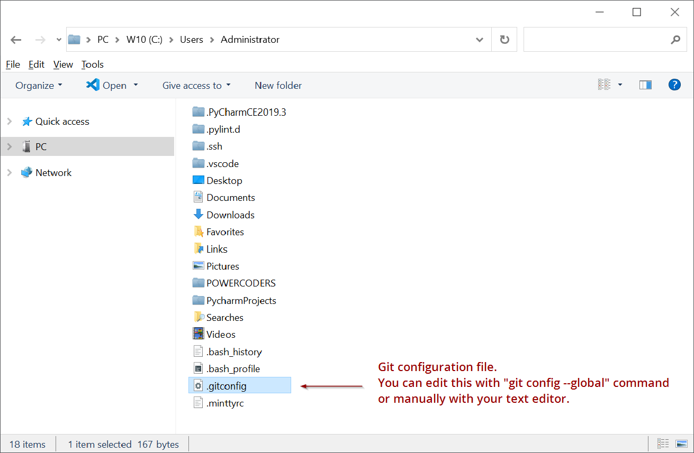

# GIT CONFIG
When you use GIT for the first time you have to setup the configuration file using `git config` command.<br>
You'll do this just once.

<br>


1. **Git configuration, username and email**<br>
    Do only when you install git or/and when you want to change the user infos.
    ```bash
    $ git config --global user.name "John Doe"
    $ git config --global user.email johndoe@example.com
    ```

    > *Note the `--global` flag. All the options will be written into the global config file :*

    

    <br>


2. **Git configuration, other options**

    ```bash
    # Formatting and Whitespace - to avoid annoying messages
    $ git config --global core.autocrlf false   # don't check line endings
    $ git config --global core.safecrlf false   # don't show line endings messages

    # List all the settings Git can find at that point:
    $ git config --list

    # Prefered editor for git
    $ git config --global core.editor "code --wait"

    # To save your git credentials into the configuration file
    $ git config --global credential.helper wincred
    ```

    [All you need to know about git config ➚](https://www.atlassian.com/git/tutorials/setting-up-a-repository/git-config)