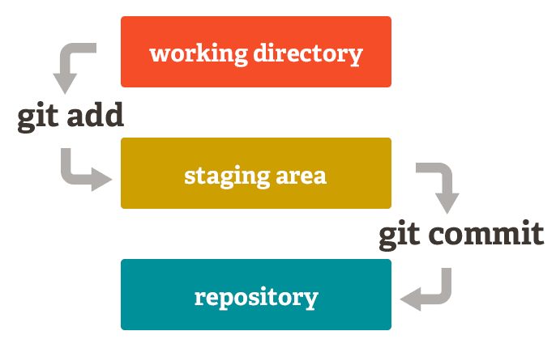

# GIT MOST USED/USEFUL COMMANDS

A customized list of most useful commands with GIT.<br>
Git is (incredibily) complex. We have a lot of tutorials online where everybody tries to summarize "the best Git commands".<br>
The content bellow is what I believe to be the most useful for us, @Powercoders.

<br>

## Basic operations
  ### cd
  Not related to Git but, **the first thing to do, always, is to go into the target folder**
  ```sh
  # Generic
  $ cd <path>

  # Example
  $ cd ~/powercoders/my-project
  ```

  <br>
  ---
  <br>

  ### clone
  Cloning a remote repository from Git. A clone is an exact replica of the target repo.
  
  ```sh
  # Generic
  $ git clone <url>
  
  # Example :
  $ git clone https://github.com/powercoders-lausanne/support.git
  ```

  <br>
  ---
  <br>

  ### add + commit + push
  Those 3 come together, in this order.<br>
  Adding the latest changes to Git while describing what these changes are.
  
  <figure align="center">
    <figcaption>Illustration of the process. <a href="https://dev.to/sublimegeek/git-staging-area-explained-like-im-five-1anh">Source</a></figcaption>
  </figure>

  #### 1. add

  ```sh
  # Generic
  $ git add <file name 1> <file name 2>
  
  # Examples
  $ git add README.md                         # a file at the root (same level as .git folder)
  $ git add css/styles.css                    # a file inside a folder
  $ git add index.html about.html             # add two (or more) files
  $ git add .                                 # add ALL the files (who changed)
  
  # [Remember] Git do not add empty folders.
  ```

  #### 2. commit
  ```sh
  # Generic
  $ git commit -m "short description of the change you made to the file(s)"
  
  # Examples when adding/updating "styles.css"
  $ git commit -m "Initial commit"            # Only once, when the file is created
  $ git commit -m "Updated helper classes"
  $ git commit -m "Removed repetead styles"
  ```
  
  #### 3. push
  ```sh
  # Generic and example
  $ git push
  ```
  <br>

  **[TIP] For lazy people: *add, commit, push* in one step**<br>
  You could do this when you're trained enough with Git and you want to accelerate things.<br>
  Don't use this if you're just discovering Git, first, work a little ! :-))
  ```sh
  # 1. Create an alias in your ".bash_profile" or ".bashsrc" file.
  # In this case, we'll create the alias "gitGO" who refers to the "git_add_commit_push()" function :
  git_add_commit_push() {
    git add .
    git commit -m "$1"
    git push
  }
  alias gitGO=git_add_commit_push

  # 2. Restart your bash console
  
  # 3. After restarting your bash console, use the alias like this :
  $ gitGO "your message..."
  ```

  <br>
  ---
  <br>

  ### pull
  Integrate remote changes
  
  ```sh
  # Generic & example
  $ git pull
  ```

  <br>
  ---
  <br>

  